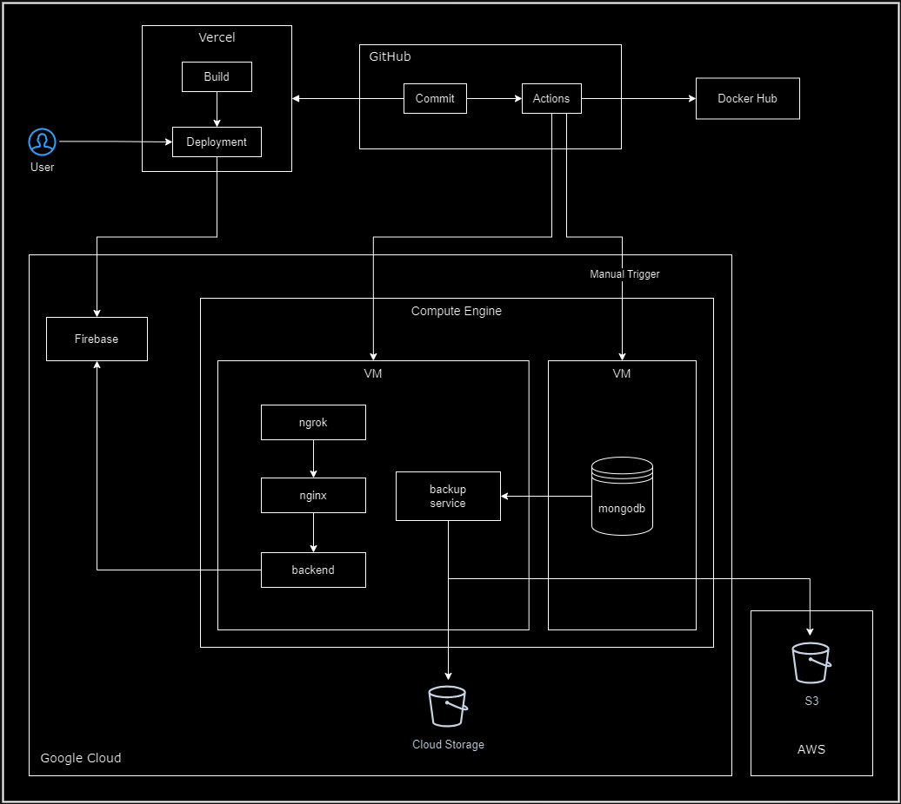

# Remember 🧠
Never forget any facts again!

## GCP VM Setup Steps
* Create keys with `ssh-keygen -C <username>` and add public key to gcp vm **Metadata**
* Add private key & username to github secrets
* Create gcp vm with ubuntu 22.04
* Add public IP to github secrets

## AWS VM Setup Steps
* Create keys with `ssh-keygen -C <username>` and add public key to aws vm **Key Pairs**
* Add private key & username to github secrets
* Create gcp vm with ubuntu 22.04
* Add public IP to github secrets
* Create new github user for CI
```bash
sudo adduser github --disabled-password
sudo sudo mkdir -p ../github/.ssh
sudo cp .ssh/authorized_keys ../github/.ssh/authorized_keys
sudo chown -R github:github ../github/.ssh
sudo visudo
# Add following line at the end
# github  ALL=(ALL)  NOPASSWD:ALL
```

## Ubuntu Setup
### Option 1 (Manual)
* SSH with `github` user in VM
* Install docker & compose on VM
```bash
wget https://gist.githubusercontent.com/blurrycontour/cb8f62bd265e8cf335d3938745e985f3/raw/1eaee626b6a67047d3cbc2c39bdc33b039f61962/install_docker.sh
sudo chmod +x install_docker.sh
sudo ./install_docker.sh
# sudo groupadd docker
sudo gpasswd -a $USER docker
```

### Option 2 (Automated)
Use the **Setup Docker** GitHub action workflow to set up Docker on the given virtual machine.

## Database Setup
Use the **Deploy Database to Cloud** GitHub action workflow to set up MongoDB on a VM. After this login to the database as admin using the appropriate credentials. Create users using the code in `database/users.js`. Update GitHub secrets accordingly.

To run locally use `docker-compose -f database/docker-compose.yaml --env-file ./.env up -d`


## Misc
### Firebase setup
* Create a Firebase project (Spark plan)
* Enable Google and GitHub authentication
* Create a Firebase service account and add encoded credentials to GitHub secrets
* Add the domains from which authentication requests would need to be approved

Commands to encode credentials to base64 to be used as GitHub secrets:
```bash
cat ~/.aws/credentials | base64 -w0
cat ~/.gcp/gcp-credentials.json | base64 -w0
cat ~/.gcp/firebase-credentials.json | base64 -w0
```

Other useful commands:
```bash
cp .env.template .env
docker-compose --profile <profile> config
sudo rm -rf data/mongo/db/*
docker-compose -f database/docker-compose.yaml --env-file ./.env --profile <profile> config
```

To run locally:
- All env vars in .env file
- All credentials in ~/.gcp and ~/.aws
- For application `docker compose --profile stage up -d`


## System Diagram

